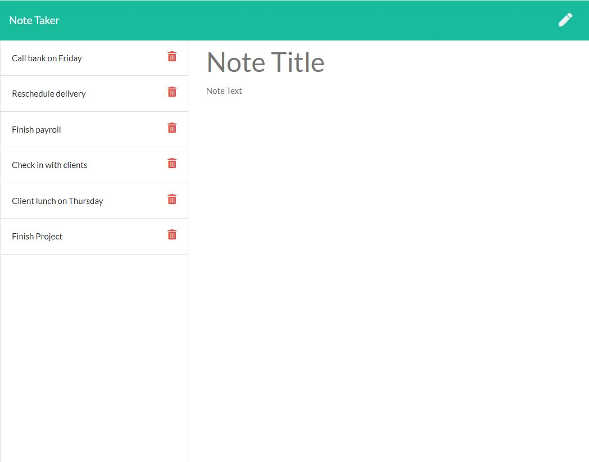

# Note Taker
An application to write and save note with Express.js back end and will save and retrieve note data from JSON file.

### Github : https://github.com/RetroColossus/Note-Taker

### Deployed app : https://note-taker-retro.herokuapp.com/


## Description
An application to write and save note with Express.js back end and will save and retrieve note data from JSON file.

## User Story
```
- AS A small business owner
- I WANT to be able to write and save notes
- SO THAT I can organize my thoughts and keep track of tasks I need to complete
```


## Usage
- Application will allow user to be able to add note's title and description
- Application will allow user to be able to save the notes and won't lose them even they refresh the page
- Application will allow user to be delete notes

## Screenshots



